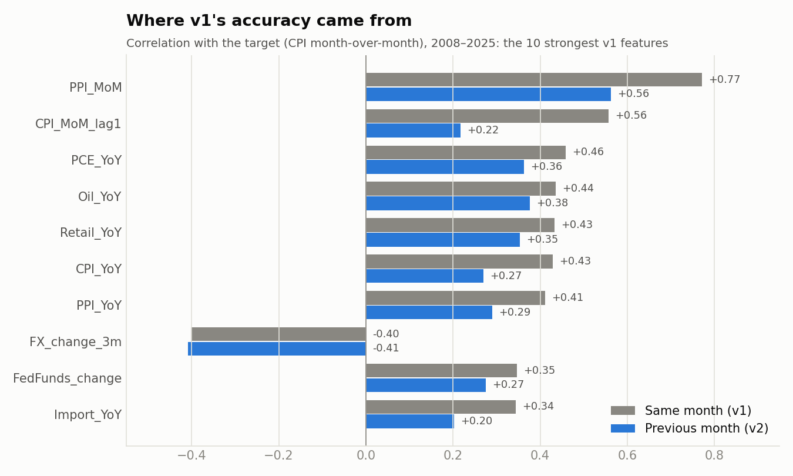
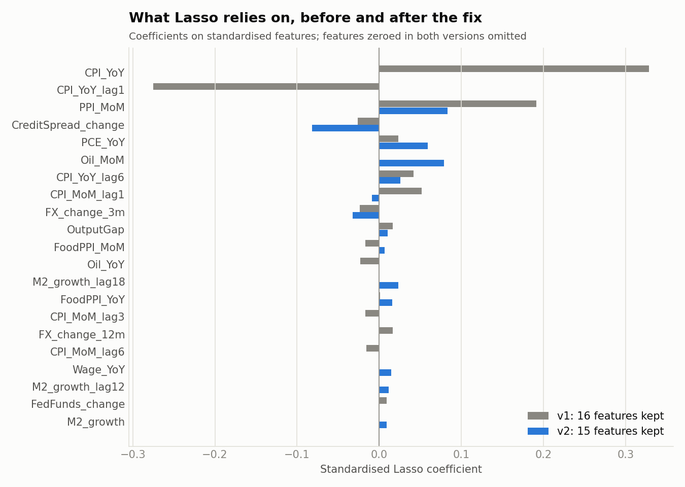
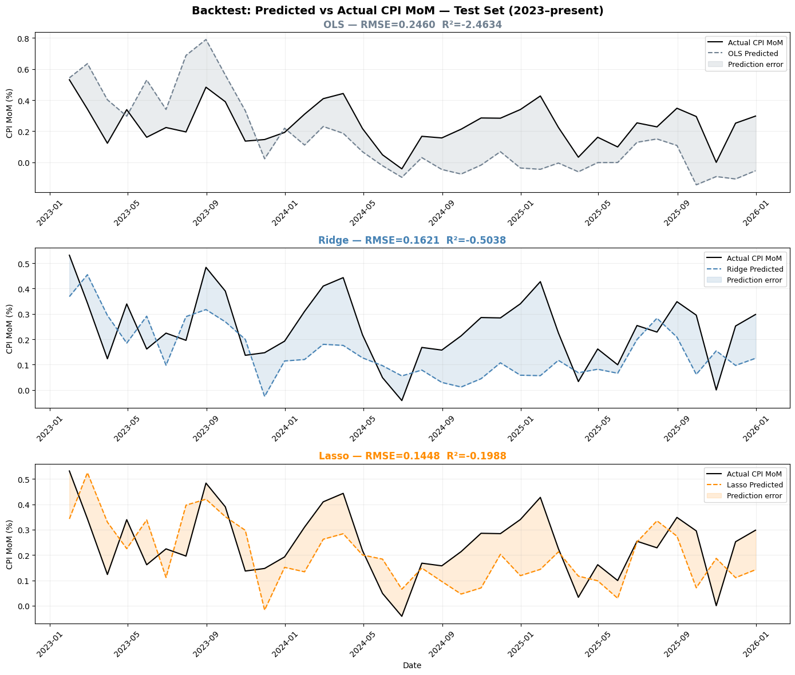
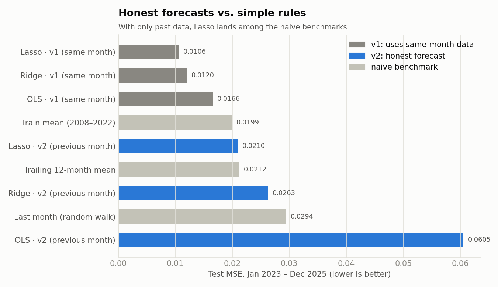
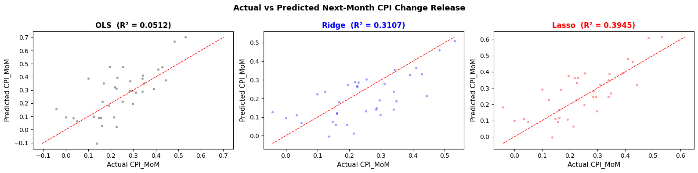
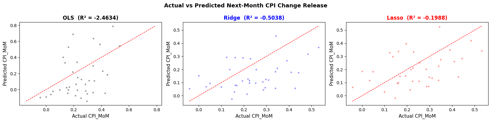
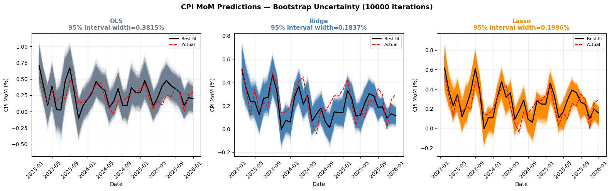
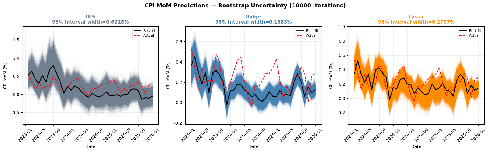
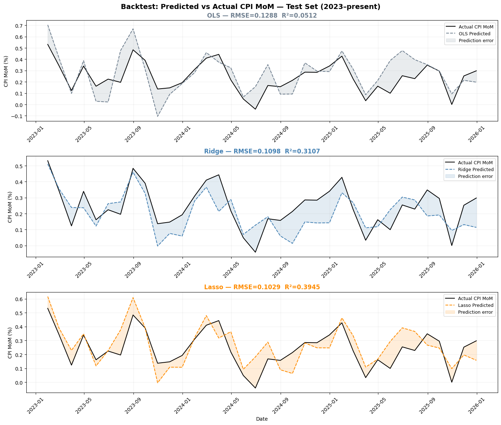

# Forecasting Monthly US Inflation with Regularised Regression

Can macro data from FRED predict next month's CPI change? OLS, Ridge and Lasso
are trained on 28 engineered features covering monetary policy, cost-push,
activity and demand, from 2008 to 2022, and tested on 2023–2025. Baruch
College Pre-MFE, Machine Learning.

The project exists in two versions. **v1** is the original submission. **v2**
fixes one flaw, look-ahead leakage, and changes nothing else. The gap between
them is the most instructive result here.

| | v1: original submission | v2: next-month forecast |
|---|---:|---:|
| Features measured in | the **same** month as the target | the **previous** month |
| Lasso test R² | 0.394 | **−0.199** |
| Ridge test R² | 0.311 | −0.504 |
| OLS test R² | 0.051 | −2.463 |
| Lasso test MSE | 0.0106 | 0.0210 |
| Features Lasso keeps | 16 of 28 | 15 of 28 |

(v1 figures are re-run on the current FRED vintage. The original submission
reported 0.388 / 0.301 / 0.049.)

---

## 1. The design (what the original got right)

These choices hold up, and v2 keeps all of them:

- **A stationary target and features.** The target is the monthly CPI change,
  not the CPI level. Level series share trends and produce spurious R² values
  near 1. Every input is a growth rate, a percentage change or a first
  difference, and the raw levels are dropped before modelling.
- **Economic structure in the features.** Four channels are represented:
  monetary (fed funds changes, M2 growth at 6, 12 and 18-month lags), cost-push
  (oil, import prices, producer prices, the dollar), demand (retail sales, PCE,
  wages, the output gap) and financial stress (the credit spread). Producer
  prices (PPI) were added beyond the suggested list, as a pass-through channel.
- **Validation that respects time.** Ridge and Lasso penalties are chosen with
  5-fold `TimeSeriesSplit`, where each fold trains on the past and validates on
  the future. That matters for serially correlated macro data, where shuffled
  k-fold would leak.
- **An out-of-sample test period** (2023–2025) that no tuning step ever sees.
- **Regularisation for correlated inputs.** Many features overlap (CPI and PPI
  year-on-year changes correlate at 0.9). Ridge shrinks them together, and Lasso
  zeroes out about half.
- **Uncertainty, not just point forecasts.** 10,000 bootstrap refits give a
  prediction band for every test month.

## 2. The flaw: the model could see the answer

In v1, every feature is measured in the **same month** as the target. Two
kinds of feature give the answer away:

1. **`CPI_YoY` is built from the target month's CPI.** Paired with last
   month's year-on-year rate, its change is almost exactly this month's
   change. Lasso found this: its two largest v1 weights are `CPI_YoY` (+0.33)
   and `CPI_YoY_lag1` (−0.27), which together reconstruct the answer.
2. **Same-month releases.** `PPI_MoM`, `Oil_MoM` and `FoodPPI_MoM` describe the
   month being predicted. PPI is published around the same day as CPI, so it's
   not available beforehand. `PPI_MoM` alone correlates 0.77 with the target.

So v1 is a same-month **nowcast** with look-ahead, not the next-month
forecast its charts describe.





## 3. The fix

Every feature is lagged one month, so month *t* is predicted only from what
was known by the end of month *t − 1*. The target stays in place:

```python
target = df_feat["CPI_MoM"]
df_feat = df_feat.drop(columns=["CPI_MoM"]).shift(1)
df_feat.insert(0, "CPI_MoM", target)
```

Those three lines are the only modelling change between
[`v1_original.ipynb`](notebooks/v1_original.ipynb) and
[`v2_next_month.ipynb`](notebooks/v2_next_month.ipynb).

## 4. What an honest forecast achieves



A negative R² means the model does worse than predicting the test period's
average. To judge that fairly, compare against simple rules on the same months
([`scripts/baselines.py`](scripts/baselines.py)):



**Lasso lands among the naive benchmarks.** It beats "same as last month" and
matches a trailing 12-month average, but it doesn't beat the historical mean.
Regularisation clearly earns its keep: unpenalised OLS overfits to an MSE
nearly three times Lasso's. But the macro features add little beyond the
average.

**Why the signal vanishes.** Relationships learned in 2008–2022 were driven by
large shocks (the financial crisis, the pandemic, the 2021–22 surge), and they
don't carry into a calmer period. Lagged PPI shows it most clearly:

| Period | Correlation of last month's PPI change with this month's CPI change | Volatility of monthly CPI change |
|---|---:|---:|
| 2008–2022 (train) | 0.60 | 0.34 |
| 2010–2019 (calm) | 0.33 | 0.19 |
| 2023–2025 (test) | **0.03** | **0.13** |

Two effects compound. The predictive relationship collapses, and the test
period is so quiet that R² penalises every miss heavily, because there's
little variance to explain.

**How the errors break down.** v2 Lasso under-predicts in 72% of test months
(average forecast 0.20% against 0.24% actual), since 2023–25 inflation ran
above the 2008–22 norm. But that level bias is only **8% of its error**. The
other 92% comes from missing month-to-month swings.

<table><tr>
<td><br><em>v1: same-month features</em></td>
<td><br><em>v2: next-month forecast</em></td>
</tr></table>

## 5. Weaknesses and how each was handled

| Issue | Effect | Status |
|---|---|---|
| Same-month features, incl. `CPI_YoY` | Look-ahead, inflated R² | ✅ **Fixed in v2** (features lagged one month) |
| API key hard-coded in the notebook | Credential exposure | ✅ **Removed.** Data comes from FRED's public CSV via [`fetch_fred.py`](scripts/fetch_fred.py), with no key |
| Undefined variable (`df`) | Notebook failed in a fresh kernel | ✅ **Fixed** (one line removed) |
| MSE printed as "RMSE" | Mislabelled metric | ✅ **Fixed** |
| No benchmark | A negative R² was uninterpretable | ✅ **Added** [`baselines.py`](scripts/baselines.py) |
| Quarterly GDP stamped at its quarter's start | In two of every three months, `OutputGap` and `GDP_growth` use a GDP figure published up to about 6 weeks after the forecast date | ⚠️ **Remaining.** Fix: lag GDP about 4 months, or use release-date vintages |
| `GDP_growth` described as year-on-year | `pct_change(4)` on a monthly series is a 4-month change | ⚠️ **Documented**, kept as in the original |
| Revised data, not real-time data | FRED serves today's revised history, not what forecasters had then | ⚠️ **Remaining.** Fix: ALFRED vintage data |
| October 2025 CPI never published (shutdown) | Forward-filled: October reads 0%, November carries two months | ⚠️ **Documented**, kept as in the original pipeline |
| Bootstrap resamples months independently | Ignores autocorrelation, so bands are likely too narrow | ⚠️ **Remaining.** Fix: block bootstrap |
| Filtered and selected feature sets built but unused | Final models use all 28 features | ⚠️ **Documented**, kept to preserve the original design |
| Small test window (36 months, one regime) | R² is unstable | ⚠️ **Remaining.** Fix: rolling-origin evaluation over more years |

<details><summary><b>Bootstrap uncertainty bands, v1 vs v2</b></summary>



</details>

<details><summary><b>v1 backtest</b></summary>


</details>

## Run it

```bash
pip install pandas numpy scikit-learn scipy matplotlib seaborn jupyter
python scripts/fetch_fred.py          # data/fred_monthly.csv, FRED public CSV, no API key
jupyter nbconvert --to notebook --execute --inplace notebooks/v2_next_month.ipynb
python scripts/baselines.py           # naive benchmarks
python scripts/make_figures.py        # README charts; reuses the notebook's own feature code
```

The committed `data/fred_monthly.csv` is the September 2026 vintage. FRED
revises history, so a fresh download can shift results in the third decimal.

## Layout

```
├── notebooks/        v1_original.ipynb · v2_next_month.ipynb
├── scripts/          fetch_fred.py · baselines.py · make_figures.py
├── data/             fred_monthly.csv (15 FRED series, monthly)
└── reports/figures/
```

---
Youness Yachruti · [LinkedIn](https://www.linkedin.com/in/youness-yachruti/)
